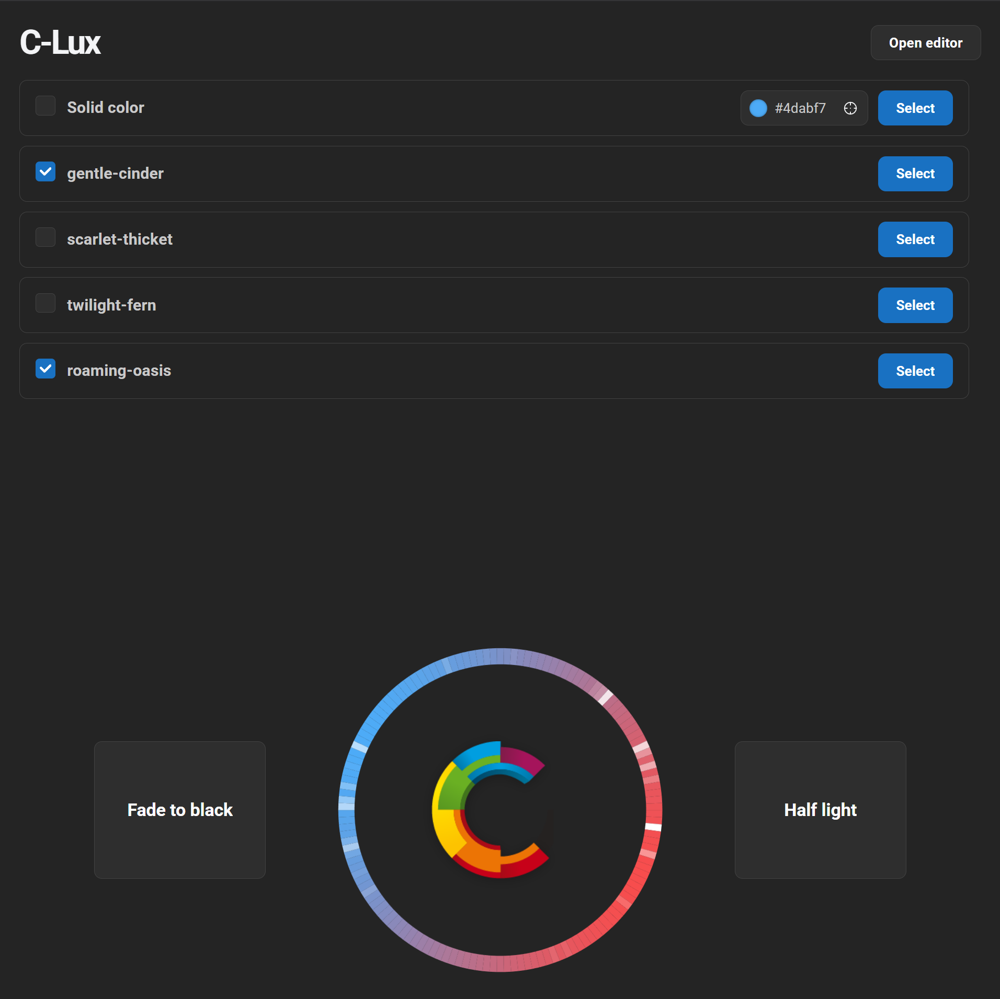

# C-Lux

C-Lux is a lighting console for cove and ring installations built from addressable LEDs - the kind that runs around the spring line of a planetarium dome. Instead of programming cues light by light, you stack ready-made pattern layers (gradients, sunrises, auroras, comets, audio-reactive pulses, and more), tune each one's colors, speed and position from the browser, and let the server blend them into a single live frame.

Everything is driven from a web UI, so any tablet or laptop on the dome network becomes a control surface: no software to install at the console, and the show operator gets big, obvious controls (blackout, half-light for the projector side of the dome, and a fixed work-light color) while the technician keeps the full editor behind a password. Saved scenes recall a whole look instantly, transitions are faded rather than snapped, and the blended frame goes out to your fixtures over Art-Net - with rotation and per-light remapping so the pattern lines up with however the strip was physically installed.

Nothing is locked inside the UI, either. Every function the web interface offers - adding and tuning patterns, recalling or replacing scenes, blackout, half-light, the solid work-light color - is exposed as a plain HTTP REST API, and the live blended frame can be subscribed to as an event stream. That makes C-Lux straightforward to drive from a custom show application, an automation script, or the same controller that runs your projection system: fire a scene change at a cue point, dim the cove for a fulldome segment, and bring the lights back up when the show ends, all with ordinary HTTP requests.

<p align="center">
  
</p>


## Getting started

Requires Node.js 22 or newer. See the Wiki page for more detailed explanations of the available patterns.

### Development

```powershell
npm install
npm run all
```

`npm run all` starts both processes together:

- Web (Vite dev server): http://localhost:5173
- API (Express): http://localhost:8787

### Deployment

```powershell
npm install
npm run build
npm start
```

`config.json` is read from disk each time the server starts, so changes to it — including `output` fix-ups — need only a restart. `nLights` is the exception: the browser bundle is sized from it at build time, so changing it needs `npm run build` as well.

## API

All endpoints are served by the Express backend under the `/api` prefix and proxied through Vite in development. Endpoints marked with a lock require the editor password (see [Configuration](#configuration)) and answer `401` without it.

| Method | Path                             | Body                   | Description                                |
| ------ | -------------------------------- | ---------------------- | ------------------------------------------ |
| GET    | `/api/auth`                      | —                      | Whether the caller's token is still valid  |
| POST   | `/api/auth/login`                | `{ password }`         | Exchange the editor password for a token   |
| POST   | `/api/auth/logout`               | —                      | Revoke the caller's token                  |
| GET    | `/api/patterns`                  | —                      | List the active patterns' parameters       |
| POST   | `/api/patterns` 🔒               | `{ type, props }`      | Add a pattern of the given type            |
| POST   | `/api/patterns/reorder` 🔒       | `{ order: string[] }`  | Reorder patterns (controls blend order)    |
| POST   | `/api/patterns/clear`            | —                      | Remove every pattern                       |
| PATCH  | `/api/patterns/:name` 🔒         | `{ props }`            | Update an existing pattern by name         |
| PUT    | `/api/patterns/:name/enabled` 🔒 | `{ enabled }`          | Mute or unmute a single pattern            |
| DELETE | `/api/patterns/:name` 🔒         | —                      | Remove a pattern by name                   |
| GET    | `/api/blackout`                  | —                      | Whether the master blackout is engaged     |
| PUT    | `/api/blackout`                  | `{ blackout }`         | Fade output to black or restore it         |
| GET    | `/api/half-light`                | —                      | Whether half-light mode is engaged         |
| PUT    | `/api/half-light`                | `{ halfLight }`        | Fade the top half out or restore it        |
| GET    | `/api/solid-color`               | —                      | State of the fixed solid color layer       |
| PUT    | `/api/solid-color`               | `{ color?, enabled? }` | Fade it to a color, or switch it on/off    |
| POST   | `/api/audio`                     | audio analysis frame   | Feed one frame to audio-reactive patterns  |
| GET    | `/api/stream`                    | —                      | Server-Sent Events stream of frames        |
| GET    | `/api/scenes`                    | —                      | List the saved scenes                      |
| GET    | `/api/scenes/applied`            | —                      | Names of the scenes currently switched on  |
| POST   | `/api/scenes` 🔒                 | `{ name }`             | Save the active patterns as a scene        |
| POST   | `/api/scenes/import` 🔒          | exported scene JSON    | Add a scene from an exported file          |
| POST   | `/api/scenes/reorder` 🔒         | `{ order: string[] }`  | Reorder scenes (controls blend order)      |
| POST   | `/api/scenes/:name/apply`        | —                      | Add a scene's patterns to the list         |
| POST   | `/api/scenes/:name/unapply`      | —                      | Remove a scene's patterns from the list    |
| POST   | `/api/scenes/:name/replace`      | —                      | Replace the active patterns with a scene   |
| PATCH  | `/api/scenes/:name` 🔒           | `{ newName }`          | Rename a scene                             |
| DELETE | `/api/scenes/:name` 🔒           | —                      | Delete a scene                             |
| GET    | `/api/config` 🔒                 | —                      | `config.json`, without the edit password   |
| PUT    | `/api/config` 🔒                 | `{ settings, editPassword? }` | Rewrite `config.json` and adopt it   |

Unknown paths under `/api` answer a JSON `404`, and failures come back as `{ "error": "..." }` with an appropriate status.

## Configuration

Global settings live in `config.json`, which both the server and the visualizer read. The file is not part of the repository, so start from the template [`config.sample.json`](config.sample.json) and fill in the values for your installation:

```powershell
Copy-Item config.sample.json config.json
```

The server validates the file on startup and exits with a message naming the offending key if something is missing or out of range, so a typo shows up right away instead of as a dark ring later. Edits take effect on restart.

The same settings can be edited from the browser at `/config`, behind the editor password. Saving there rewrites `config.json` and the server adopts everything it reads live — the transitions and the edit password — while the page names the settings that are waiting for a restart. The password is never sent to the browser: the page only shows whether one is set, and changing it signs every editor out.

```json
{
  "nLights": 142,
  "server": {
    "tickRate": 30,
    "port": 8787,
    "remap": {},
    "editPassword": "",
    "blackoutTransition": 1.0,
    "halfLightTransition": 1.0,
    "halfLightCoverage": 0.5,
    "halfLightFeather": 0.5,
    "solidColorTransition": 1.0,
    "sceneTransition": 1.0
  },
  "output": {
    "rotation": 180,
    "artnet": {
      "enabled": false,
      "host": "0.0.0.0",
      "port": 6454,
      "net": 0,
      "subnet": 0,
      "universe": 0,
      "startChannel": 1,
      "endChannel": 0,
      "universeSize": 512,
      "refreshRate": 40
    }
  }
}
```

### Top level

| Key       | Description                                                                                    |
| --------- | ---------------------------------------------------------------------------------------------- |
| `nLights` | Number of addressable lights on the ring. Patterns and the visualizer are all sized from this. |

### `server`

| Key                    | Description                                                                                                                   |
| ---------------------- | ----------------------------------------------------------------------------------------------------------------------------- |
| `tickRate`             | Animation updates per second. 30 looks smooth for cove lighting; higher costs CPU, lower makes fast patterns look steppy.      |
| `port`                 | TCP port the API — and, in a production run, the built UI — is served on.                                                      |
| `remap`                | Per-light address fix-ups for fixtures that were wired or patched out of order (see below).                                   |
| `editPassword`         | Password guarding the edit page and the endpoints it drives. Leave empty to switch the protection off.                        |
| `blackoutTransition`   | Seconds the master blackout takes to fade out or back in.                                                                      |
| `halfLightTransition`  | Seconds half-light mode takes to fade its half out or back in.                                                                 |
| `halfLightCoverage`    | Fraction of the ring half-light mode darkens, counted down from the top. `0.5` is the top half, `1` is the whole ring.         |
| `halfLightFeather`     | How soft the edge between the dark and lit halves is. `0` gives a hard line, larger values a wider blend band.                 |
| `solidColorTransition` | Seconds the solid work-light layer takes to fade to a new color or switch on and off.                                          |
| `sceneTransition`      | Seconds a scene takes to fade in or out when it is applied, unapplied, or replaced.                                            |

Any transition set to `0` snaps instead of fading.

#### `server.remap`

Per-light address fix-ups, written as `"position": address` — the color computed for a position on the ring is sent to a different light instead. So a light that physically sits at position 14 but answers to ID 0 needs `"14": 0`.

Entries are one-way, and can be paired up when two lights need to trade places:

```json
"remap": { "14": 0, "0": 14 }
```

Lights left out of the map keep their 1:1 mapping. An entry outranks the 1:1 mapping of the light it lands on, so `{ "0": 14 }` on its own sends position 0's color to light 14 and leaves light 0 dark. Two entries pointing at the same light are rejected at startup, since only one color can be sent there.

A destination of `-1` throws the color away instead of sending it anywhere, which switches that light off for good - useful for a dead or unwanted fixture that should stay dark:

```json
"remap": { "37": -1 }
```

The visualizer ignores the map: it shows the pattern as it is meant to look, while the remap only compensates for how the fixtures are wired.

### `output`

| Key        | Description                                                                                        |
| ---------- | -------------------------------------------------------------------------------------------------- |
| `rotation` | Degrees the frame is rotated around the ring before it reaches the hardware (see below).            |
| `artnet`   | Art-Net transmission settings (see below).                                                          |

#### `output.rotation`

Degrees the frame is turned around the ring before it is sent, for installations where light 0 isn't where you'd like the pattern to start. The visualizer always keeps light 0 at the top; rotation is what lines that up with the hardware. It is the last step before the wire, after `server.remap`, so remap indices are the ring positions the visualizer shows.

#### `output.artnet`

| Key            | Description                                                                                            |
| -------------- | ------------------------------------------------------------------------------------------------------ |
| `enabled`      | Whether frames are transmitted at all. Leave `false` until the rest of the block is filled in.          |
| `host`         | The node's IP address, or a broadcast address such as `255.255.255.255` to reach every node on the LAN. |
| `port`         | UDP port to send to. Art-Net's standard port is `6454`.                                                 |
| `net`          | Art-Net net number, the top level of the address. Usually `0`.                                          |
| `subnet`       | Art-Net sub-net number. Usually `0`.                                                                    |
| `universe`     | Universe within that sub-net. Must match the node's DMX output port, or it ignores the frames.          |
| `startChannel` | First DMX channel written, 1-based. Set it to wherever the strip is patched.                            |
| `endChannel`   | Last channel written, 1-based and inclusive. `0` sends the whole frame.                                 |
| `universeSize` | Channels per universe before the frame spills into the next one. 512 is the DMX maximum and the norm.   |
| `refreshRate`  | Frames sent per second. 40 is typical; check what the node accepts.                                     |


## Adding a pattern

1. Create a class under `shared/patterns/` that extends `Pattern`, with a static `Type` tag, a static `DisplayName`, a static `Fields` schema describing its configurable parameters, and `parameters()`, `set()` and `tick()` methods. Export its props interface alongside the class.
2. Register it in the `PATTERNS` array in [`shared/patterns/patterns.ts`](shared/patterns/patterns.ts), and add its props interface to the `PatternProps` union in the same file.

The available pattern types and their parameter shapes are derived from that list, so the UI and shared types pick up the new pattern automatically. `Fields` is the single source of truth for each parameter's label, default and allowed range: the server validates incoming props against it and the browser generates the edit form from it.
